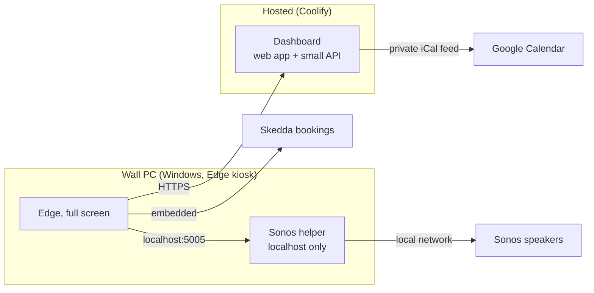

# Inspire9 Wall

A touch-friendly wall dashboard for a coworking space: the day's calendar, room bookings and music controls on one screen.



| Folder | What it is | Status |
|---|---|---|
| [`dashboard/`](dashboard) | The web app the wall shows | Layout, clock, bookings |
| `music/` | Shared Sonos code | Next |
| `helper/` | Windows service that talks to Sonos | Planned |
| `windows/` | PowerShell setup for the kiosk PC | Planned |

## The screen

```
┌──────────────────────────────────────────────────────────┐
│ logo   9:41 am  Friday 9 October                [layout] │
├────────────────────────────┬─────────────────────────────┤
│                            │ Bookings              – [ ] │
│ Calendar             – [ ] │                             │
│                            ├─────────────────────────────┤
│                            │ Music                 – [ ] │
└────────────────────────────┴─────────────────────────────┘
```

- **Drag** the handles between panels to resize.
- **–** minimises a panel, **[ ]** expands it to full screen (it returns by itself after two minutes).
- **Layout** button: Auto, Calendar focus, Bookings focus, Side by side, Stacked.
- The chosen layout is saved on the server, so it survives the browser being reset.

## Run it locally

```sh
npm install
cp dashboard/.env.example dashboard/.env.local   # then fill it in
npm run dev                                       # http://localhost:5191
```

| Setting | Purpose |
|---|---|
| `GCAL_ICS_URL` | Google Calendar secret iCal address (comma separated for several) |
| `SKEDDA_URL` | Public Skedda booking view |
| `DATA_DIR` | Where the saved layout lives |
